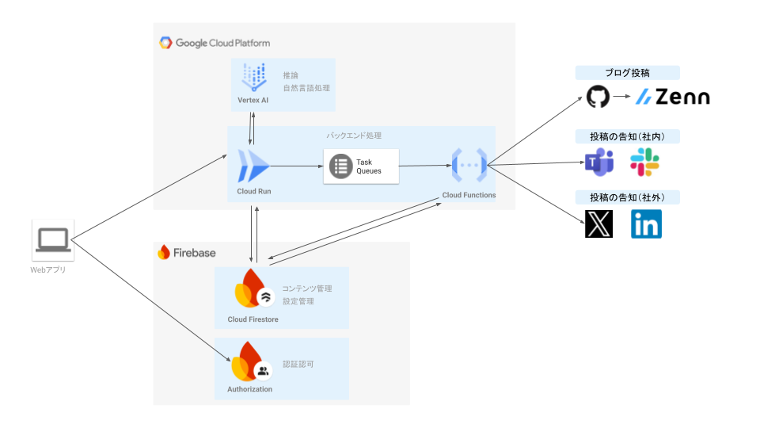

# 第ゼロ稿

## はじめに

[AI Agent Hackathon with Google Cloud](https://zenn.dev/hackathons/2024-google-cloud-japan-ai-hackathon)に向けて、技術ブログを勝手に作ってくれるAIエージェントを作成しました。
「AWSは触ったことあるけど、GCPは初めて層」だったので、AIエージェントだけでなくGCPもキャッチアップしながらで楽しかったです。

## ユーザー像

* テック領域の開発者
* 新規技術活用を求められている事業会社の新規事業担当

※まずは、自分が携わるブロックチェーン関連のトピックに特化しています

## ユーザー像における課題

日々のキャッチアップがしんどい

* 日次で新しい規格やトレンドが生まれてくる。キャッチアップに求められるスピードがとても早い
* 英語の記事が主であり、ただ読むのにも骨が折れる

## 今回作成したソリューション

### 概要

キャッチアップしたい情報のタネを入力していけば、勝手に投稿と告知をやってくれるAIエージェント。
（せっかく投稿するのだから、多くの人に読んでほしいといった下心が含まれています 笑）

### アーキテクチャ

機能 | プラットフォーム | 利用サービス
--- | --- | --- 
Webアプリホスト | （今回未実装） | （今回未実装）
認証認可 | Firebase | Authentication<br>（Github認証）
DB（投稿設定） | Firebase | Cloud Firestore
バックエンド処理①（投稿設定作成） | GCP | Cloud Run
バックエンド処理②（投稿処理の管理）|GCP |  Task Ques
バックエンド処理③（投稿処理） | GCP | Cloud Functions
推論・自然言語処理 | GCP | Vertex AI



### AIエージェントが担う役割

#### 1.ブログ記事の生成

ブログの本文とサブタイトルをVerte AIで作成。
本文作成のモデルは自分で分かりやすいと思っている方の文章を教師データとして、教師ありファインチューニングを行ったものを利用。

[/dai0kou-backend/functions/generate_setting/lib/prompt.py](../dai0kou-backend/functions/generate_setting/lib/prompt.py)

<details>

<summary>プロンプト利用部分</summary>

```python
...
def generateContents(source, count, digest):
    text = f"""
    以下内容を、わかりやすく説明するブログを作成して
    {source}

    また、これまで{str(count)}回投稿しており、前回の記事で下記内容は投稿済みであることも留意して
    {digest}
    """
    print("Generation start!!!")

    request = {
        'contents': [
            {'role': 'user', 'parts': [text]}
        ],
    }
    vertexai.init(
        project="33517488829",
        location="us-east1",
        api_endpoint="us-east1-aiplatform.googleapis.com"
    )
    tools = [
        Tool.from_google_search_retrieval(
            google_search_retrieval=grounding.GoogleSearchRetrieval()
        ),
    ]
    model = GenerativeModel(
        "projects/33517488829/locations/us-east1/endpoints/7247149419508793344",
        tools=tools,
        system_instruction=["""あなたはブログ投稿を行う作者です。与えられた情報の要約だけでなく、専門家として、技術の活用に向けた考察を加えてください"""]
    )
    
    responses = model.generate_content(
        [text],
        generation_config=generation_config,
        safety_settings=safety_settings,
        stream=True,
    )
    
    print("Generation finished!!!")
    res_text = ""
    for response in responses:
        res_text = res_text + response.text

    responses = model.generate_content(
        [text],
        generation_config=generation_config,
        safety_settings=safety_settings,
        stream=True,
    )

    print("Generation finished!!!")
    res_text = ""
    for response in responses:
        res_text = res_text + response.text + '\n'
        
    return res_text
```

</details>

#### 2.告知文の作成

シンプルにプロンプトを叩いて文章を作成

[/dai0kou-backend/functions/post/main.py](../dai0kou-backend/functions/post/main.py)

<details>

<summary>プロンプト利用部分</summary>

```python
...
def generate_post(contents):
    text = f"""
    以下内容のブログを書いている。Xで告知するための文章を100文字以内で作成して
    {contents}
    """
    
    request = {
        'contents': [
            {'role': 'user', 'parts': [text]}
        ],
    }
    vertexai.init(project="ai-agent-bamb00", location="asia-northeast1")
    model = GenerativeModel("gemini-1.5-flash-001",)
    
    responses = model.generate_content(
        [text],
        generation_config=generation_config,
        safety_settings=safety_settings,
        stream=True,
    )
    print("Generation finished!!!")
    res_text = ""
    for response in responses:
        res_text = res_text + response.text
    print(res_text)
    
    return res_text
...
```

</details>

※作成した投稿文はX APIで記事のURLと合体させて投稿している

```Python
...
# Post on X
print('start post on X')
post_body = generate_post(doc_dict["contents"][index]["body"])
post_content = f" {post_body} https://zenn.dev/bamb00eth/articles/{file_name}"
print('Post content ---')
print(post_content)
post_x(post_content)
...
```

### デモ動画


## 今回作れきれなかったもの

**記事のタネをURLだけで取り込む**

* 今回、Webページをコピペして読ませている
* これをURL指定 or ファイルアップロードだけでよしなに解説すべき内容を抜き出せるようにしたかった

**記事作成のモデルのチューニング**

* サンプル数が30弱なので、せめて150くらいは用意したかった、、
* ブログ本文も中立的な文章なので、もっと尖った文章を作成できるようにしたい

**配信時間の最適化**

* よりインプレッションを稼げる時間に配信させたかった

**X以外で投稿するためのコネクタ**

* 社内のTeamsだと腐るほどチームがあるので、なるべく読んでもらう人がいるチームに投稿させたい
